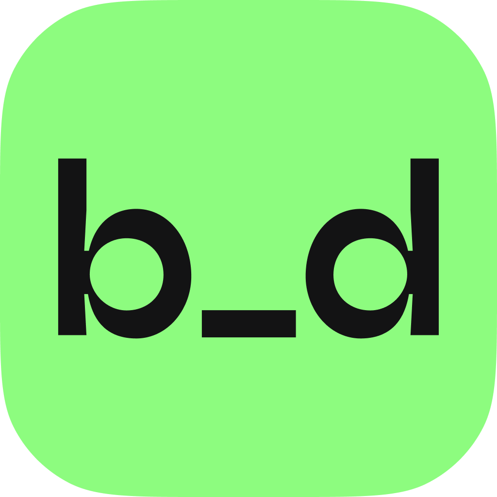

<div align="center">
    
</div>
 <br/><br/>
<div align="center">
    <p>
        
        
        
    </p>
</div>

# Bidapp ads kotlin multiplatform demo

Bidapp ads kotlin multiplatform demo for Android and IOS

# Documentation

Complete integration instructions and usage guide for the Bidapp Ads Kotlin Multiplatform library can be found [here](https://docs.bidapp.io).

# Demo APP
<div align="center">
  
  
</div>
<br/><br/>
The demo directory contains a shared module and test applications for Android and iOS

# Setting up advertising display in the demo

* Go to the [Bidapp dashboard](https://dashboard-564.pages.dev), add a new application, and connect advertising networks.  
For this demo, a test App ID for AdMob is set in the AndroidManifest for Android and in the Info.plist for iOS.

* In the build.gradle.kts file of the shared module, you can configure the adapters 	according to the settings of the advertising networks on the Bidapp dashboard.


Example for Android:
```groovy
plugins {
 android {
    //...
    dependencies {
        implementation ("io.bidapp.networks:unity:latest")
        implementation ("io.bidapp.networks:liftoff:latest")
        implementation ("io.bidapp.networks:admob:latest")
    }
  }
}
```

Example for IOS:
```groovy
plugins {
 cocoapods {
        //...
        pod("bidapp/AdMob")
        pod("bidapp/Unity")
        pod("bidapp/Liftoff")
        //...
    }
}
```

* Set in the Settings file located in the shared module the pubId for Android and iOS. Additionally, you can enable or disable:

Interstitial, Rewarded, Banner, Test mode, Logging

```kotlin
const val pubId = "xxxxxxxx-xxxx-xxxx-xxxx-xxxxxxxxxxxx"

const val isEnableInterstitial = true
const val isEnableRewarded = true
const val isEnableBanner = true
const val isEnableTestMode = true
const val isEnableLogging = true
```


### Samples


# Contact Us

Email: [support@bidapp.io](support@bidapp.io)
